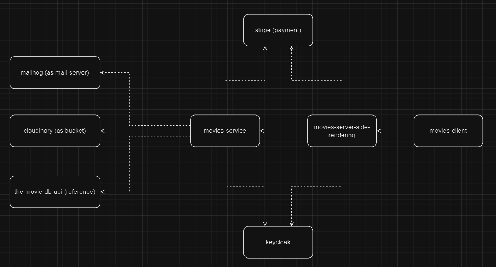
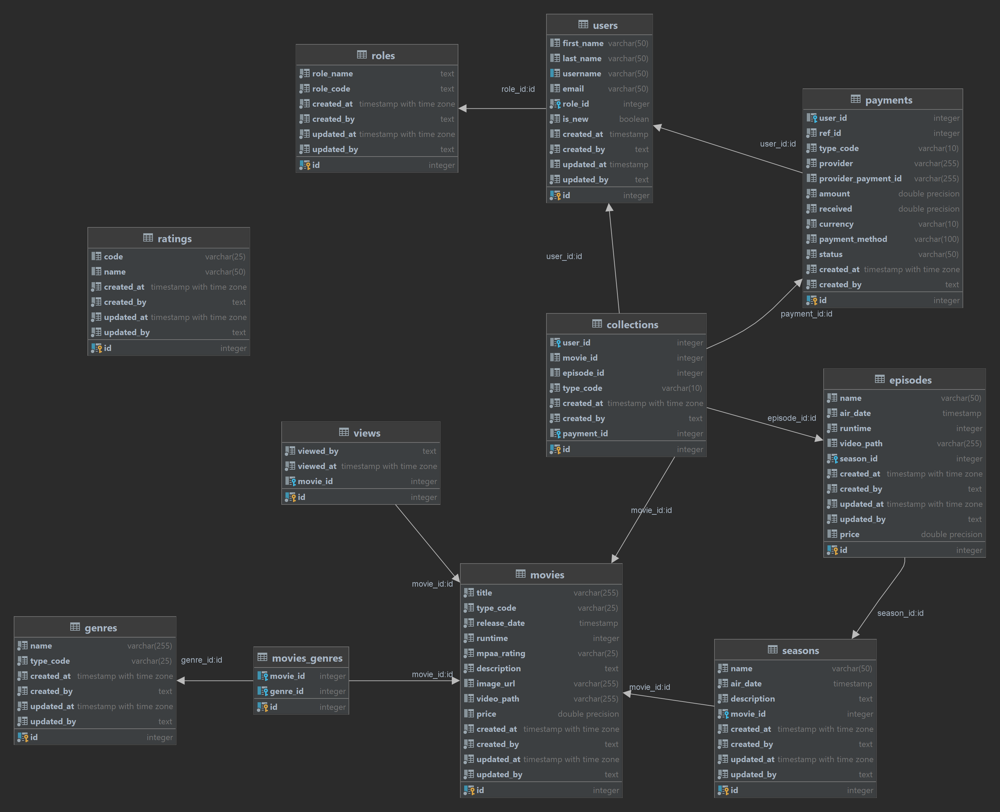

# PURPOSE

1. User registration using Keycloak.
2. Visit and watch movies.
3. Search information about movies.
4. Advanced Search for movies.
5. Manage users.
6. Manage catalogue.
7. Dashboard with Charts.
8. Integration with [Cloudinary](https://cloudinary.com/)
   and [TMDB](https://developer.themoviedb.org/reference/intro/getting-started)
10. Integration with [Stripe](https://stripe.com/docs) for payment.
11. Send email with [MailHog](https://github.com/mailhog/MailHog) as host to catch outgoing SMTP delivery

## Futuristic features

1. Media Management
2. Different OAuth providers
3. Cronjob

# STRUCTURE

1. `Postgresql` port `5432`
2. `Keycloak Admin Console`: port `8086`
3. `MailHog`: SMTP port `8003`, UI port `8100`
4. `API`: port `9090`
5. `Website`: port `3000`

# HIGH LEVEL DESIGN



## DATABASE DESIGN



## ShiftFlix API

This API build using

### Major Dependencies

1. [Gin](https://gin-gonic.com/): A web framework written in Golang.
2. [GORM](https://gorm.io/): The fantastic ORM library for Golang.
3. [Gocloak](https://github.com/Nerzal/gocloak/): Golang keycloak client.
4. [Go Simple Mail](https://github.com/xhit/go-simple-mail): The best way to send emails in Go with SMTP Keep Alive and
   Timeout for Connect and Send.

### Database

1. Use `POSTGRESQL` with port `5432`, create a new database named `mdb`
2. SQL script under `movies-back-end/sql`

### Code Layout

#### Golang Code

1. Main function to run under `cmd/api`
2. All configurations are stored in `config` folder for different environments.
3. All routes are init under `internal/server`
4. Use Dependency Injection with each package (with name) will have `delivery/http`, `service` and `repository (if any)`
   layer

## ShiftFlix NextJS Website

### Major Dependencies

This website build using

1. [npm](https://www.npmjs.com/): The node package manager for building.
2. [React](https://reactjs.org/): The core frontend framework.
3. [Next.js](https://nextjs.org/): A React scaffolding framework to streamline development.
4. [NextAuth.js](https://next-auth.js.org/): A user authentication framework to ensure we handle accounts with best
   practices.
5. [MUI](https://mui.com/): A wide collection of pre-built UI components that generally look pretty go
6. [Chart.js](https://www.chartjs.org/): Simple yet flexible JavaScript charting library for the modern web
7. [Video.js](https://videojs.com/): Video.js is a web video player built from the ground up for an HTML5 world.
8. [Redux](https://redux.js.org/): Redux is a predictable state container for JavaScript apps
9. [Jest](https://jestjs.io/): Jest is a delightful JavaScript Testing Framework with a focus on simplicity.

#### Set up your environment

1. Golang version `>= 1.19`, you can [download Go here](https://go.dev/dl/)
2. Node 16: if you are on windows, you can [download node from their website](https://nodejs.org/en/download/releases),
   if you are on linux, use [NVM](https://github.com/nvm-sh/nvm) (Once installed, run `nvm use 16`)
3. [Docker](https://www.docker.com/): This project use docker to simplify running dependent services.

### Code Layout

#### React Code

All react code is under `src/` with a few subdirectories:

1. `pages/`: All pages a user could navigate too and API URLs which are under `pages/api/`.
2. `components/`: All re-usable React components. If something gets used twice we should create a component and put it
   here.
3. `lib/`: A generic place to store library files that are used anywhere. This doesn't have much structure yet.

NOTE: `styles/` can be ignored for now.

## Getting everything up and running

If you're doing active development we suggest the following workflow:

1. Make sure you run `npm i` and `npm run build` in `movies-front-end` folder, and `go build -o apiBinary ./cmd/api`
   in `movies-back-end` folder
    - Currently, docker files is not support to build on docker, this project just create images locally, and transfer
      them for docker compose
2. Open the terminal, navigate to the `project` folder.
3. Run `docker compose up --build`. You can optionally include `-d` to
   detach and later track the logs if desired.
4. If you don't want to run docker compose on your own, you can use `Makefile` to automatically execute this process to
   build images and run docker
    - Make sure you have [Make](https://linuxhint.com/run-makefile-windows/) on your system
    - At `project` folder, open the terminal and run `make up_build`
5. Now, you can access Keycloak Admin Console at `localhost:8086/admin` with default username `admin` and
   password `admin`

## Export realm from Keycloak

```
/opt/keycloak/bin/kc.sh export --dir /opt/keycloak/data/import --realm mdb --users realm_file
```

```
docker cp <container_id>:/opt/keycloak/data/import/mdb-realm.json c:/temp/mdb-realm.json
```

## Learn More

To learn more about Next.js, take a look at the following resources:

- [Next.js Documentation](https://nextjs.org/docs) - learn about Next.js features and API.
- [Learn Next.js](https://nextjs.org/learn) - an interactive Next.js tutorial.
